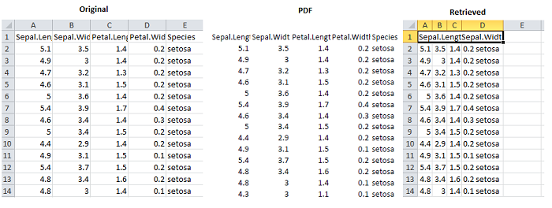

pdftables
=========

[](http://cran.r-project.org/web/packages/pdftables) [](https://travis-ci.org/expersso/pdftables) [](http://cran.r-project.org/web/packages/pdftables)

### Introduction

The `pdftables` package allows the user to convert PDF tables to formats more amenable to analysis (csv, XLM, or XLSX) by wrapping the [PDFTables API](https://pdftables.com).

The package can be installed from either CRAN or Github (development version):

``` r
# From CRAN
install.packages("pdftables")

# From Github
library(devtools)
install_github("expersso/pdftables")

library(pdftables)
```

To use the package the user first needs to sign up to the [PDFTables API](https://pdftables.com/join) to get an API token (they offer a free package that allows up to 50 pages).

### Usage Example

In the following example we first write the `iris` dataset to a `.csv` file. We then open that file and print it as a `.pdf` file. Using the `convert_pdf` function we then upload that PDF to the [PDFTables API](https://pdftables.com) which parses and returns the converted file as `test2.csv`.

(Note: All functions in the package require that you provide your api key in the `api_key` argument. By default this looks for an environment variable called `pdftable_api`, but you can also provide it directly.)

``` r
write.csv(head(iris, 20), file = "test.csv", row.names = FALSE)

# Open test.csv and print as PDF to "test.pdf"

convert_pdf("test.pdf", "test2.csv")
# Converted test.pdf to test2.csv
```



If the `output_file` argument is omitted, the name of the output file will be the same as the input file, but with the right file extension.

The package (and API) supports converting PDFs to `.csv`, `.xml`, and `.xlsx`.

Note that the conversion sometimes fails to recover the underlying data exactly, so you may have to open the retrieved file and make some manual corrections.

The `get_remaining` function shows you how many pages you have remaining.

``` r
get_remaining()
```
